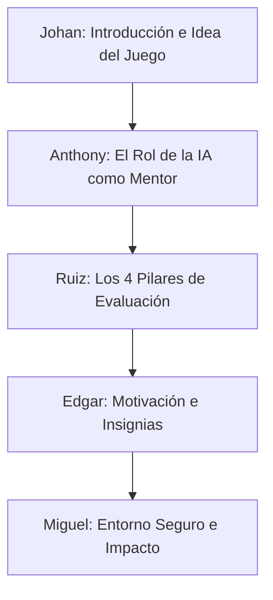

# Guía de Exposición: Transformador de Mensajes Asertivos 🧠💬

Esta guía está diseñada para presentar el proyecto ante un jurado enfocado en **competencias blandas, inteligencia emocional y resolución de conflictos**. La explicación evita términos técnicos (servidores, APIs o bases de datos) y se enfoca en el **impacto pedagógico, psicológico y formativo** del juego.

---

## 👥 Distribución de Roles

---

## 1. Johan: Introducción e Idea del Juego
### 🎯 Tema: El Concepto y la Misión del Aprendizaje Activo

* **Qué debes explicar**:
  * **La problemática**: Muchas personas dañan sus relaciones (laborales, familiares o académicas) no por *lo que* dicen, sino por *cómo* lo dicen. La comunicación no asertiva genera conflictos y resentimientos.
  * **El concepto del juego**: El juego pone al usuario frente a **50 situaciones de la vida real** divididas en diferentes contextos (trabajo, universidad, familia, pareja, amigos y servicio al cliente).
  * **El rol del jugador**: El jugador no solo es un espectador; recibe un mensaje hostil o pasivo (como *"Usted nunca hace nada bien"*) y tiene el desafío de **"traducirlo"** en una propuesta asertiva y saludable antes de enviarlo.
* **Frase clave para el profesor**: 
  > *"Diseñamos este juego no como un simple corrector de textos, sino como un gimnasio de inteligencia emocional donde las personas practican cómo expresar límites sanos de forma respetuosa."*

---

## 2. Anthony: El Coach Virtual
### 🎯 Tema: El Rol de la Tecnología en el Acompañamiento Formativo

* **Qué debes explicar**:
  * **El rol del evaluador**: La inteligencia artificial aquí no actúa como un juez estricto, sino como un **coach o mentor empático** que acompaña al alumno en su aprendizaje.
  * **Análisis de intenciones**: La IA lee el texto del alumno y descifra su estilo de comunicación implícito: si es demasiado tímido (pasivo), hiriente (agresivo) o indirecto (pasivo-agresivo).
  * **Retroalimentación constructiva**: El coach virtual no castiga el error. Explica de forma escrita **por qué** la frase elegida puede malinterpretarse y le regala una **sugerencia óptima** para modelar cómo se vería una comunicación asertiva excelente.
* **Frase clave para el profesor**:
  > *"La tecnología nos sirve aquí como un espejo de autoconocimiento. Le devuelve al alumno un reflejo de su tono y le enseña alternativas de diálogo basadas en el respeto mutuo."*

---

## 3. Ruiz: Los Pilares de la Comunicación
### 🎯 Tema: Las 4 Dimensiones evaluadas por el Coach

* **Qué debes explicar**:
  * Para calificar al alumno, el juego evalúa cuatro habilidades humanas esenciales:
    1. **Empatía**: La capacidad del alumno para validar el punto de vista y los sentimientos de la otra persona en el mensaje.
    2. **Respeto**: La ausencia de palabras acusatorias, ironías, gritos o lenguaje de culpabilidad.
    3. **Claridad**: La habilidad para ir al grano, expresar la necesidad o límite sin rodeos y evitar confusiones.
    4. **Asertividad**: La firmeza del alumno para defender su postura de forma constructiva y proponer soluciones.
  * **El Puntaje**: La combinación de estas habilidades da una nota de 0 a 100, recordándole al alumno que la asertividad es una suma de empatía y firmeza.
* **Frase clave para el profesor**:
  > *"Evaluamos por separado la empatía y la firmeza porque la asertividad perfecta es el equilibrio entre ambas: ser suaves con las personas, pero firmes con los límites."*

---

## 4. Edgar: Motivación y Gamificación
### 🎯 Tema: El Reconocimiento al Crecimiento Personal

* **Qué debes explicar**:
  * **Las Insignias de Progreso**: El juego otorga reconocimiento inmediato mediante insignias motivacionales que representan el nivel de madurez comunicativa del alumno:
    * `0-25`: **Explorador de la Comunicación** 🔍 (Está dando sus primeros pasos).
    * `26-50`: **Comunicador en Desarrollo** 🌱 (Aprende a identificar sus impulsos).
    * `51-75`: **Comunicador Confidente** 💪 (Expresa sus ideas con gran respeto).
    * `76-100`: **Maestro de la Asertividad** 🏆 (Domina la diplomacia y el liderazgo).
  * **Estadísticas de la Sesión**: El juego mide cuántos retos has superado y tu promedio global de asertividad.
  * **La Bitácora (Historial)**: Un espacio para que el alumno archive sus evaluaciones y reflexione sobre cómo ha ido mejorando su puntuación a lo largo del tiempo.
* **Frase clave para el profesor**:
  > *"Usamos la gamificación para premiar el esfuerzo de cambio. Al ver subir sus puntajes y ganar insignias, el alumno asocia el esfuerzo de comunicarse bien con una experiencia positiva y divertida."*

---

## 5. Miguel: Experiencia del Usuario e Impacto Educativo
### 🎯 Tema: El Entorno Seguro para Cometer Errores

* **Qué debes explicar**:
  * **Un entorno seguro ("Sandbox")**: En la vida real, un error al hablarle a un jefe o a una pareja puede romper una relación. Aquí, el diseño amigable y el tono cálido del juego crean un espacio libre de consecuencias reales donde **está permitido equivocarse para aprender**.
  * **Aprendizaje dinámico**: La teoría de las competencias blandas suele ser pasiva (leer libros o escuchar diapositivas). Este juego propone **aprender haciendo**, donde el cerebro del alumno se esfuerza por redactar y estructurar ideas de forma activa.
  * **Accesibilidad**: Es una herramienta stateless (sin registros ni contraseñas), lo que permite que cualquier persona entre a entrenar su empatía de inmediato en menos de 5 segundos.
* **Frase clave para el profesor**:
  > *"El verdadero valor de este proyecto es que transforma la teoría de las habilidades blandas en práctica pura. Es una herramienta accesible que enseña a las personas a construir puentes en lugar de muros a través de las palabras."*
